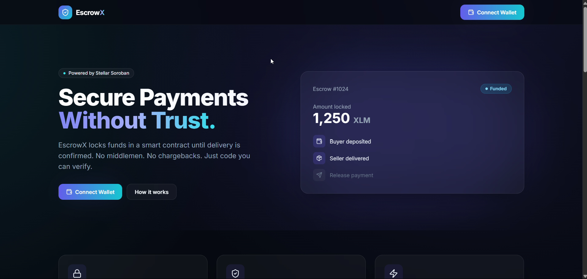
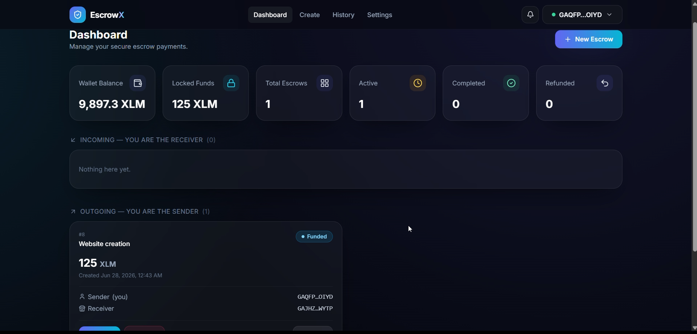
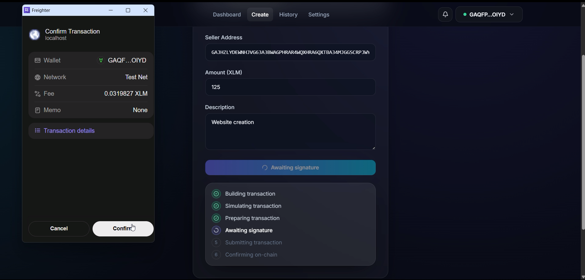
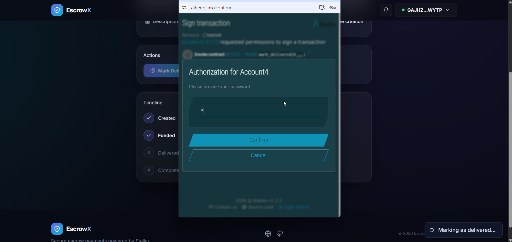
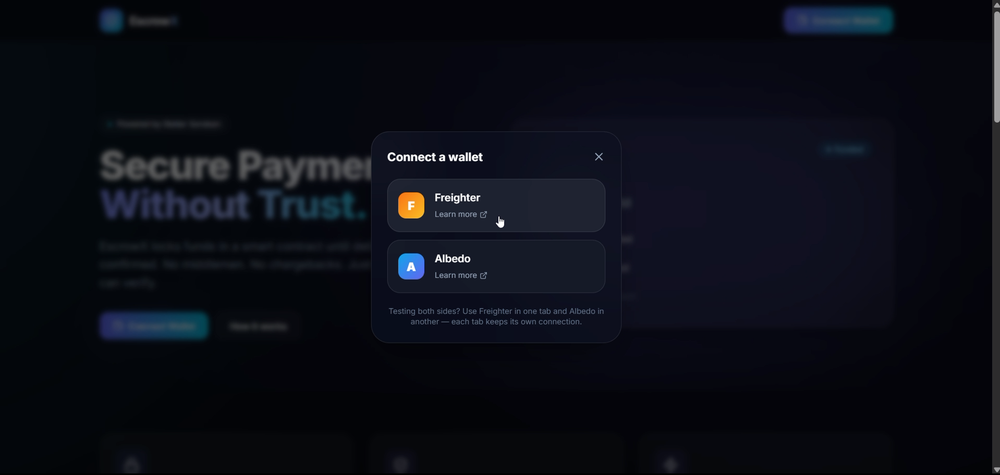
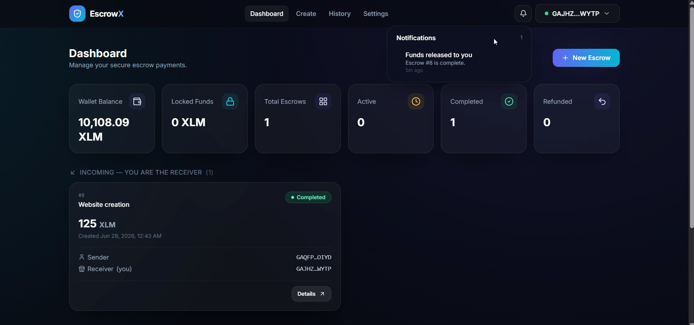
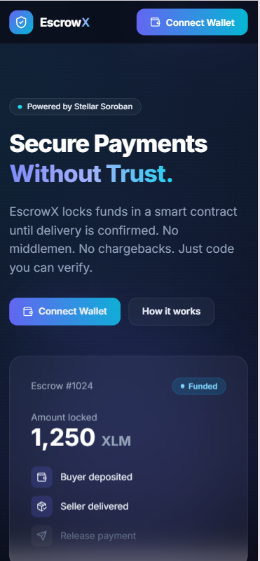

# EscrowX

> A trustless escrow dApp on **Stellar / Soroban**. Lock funds in a smart contract, deliver the work, and release payment only when both parties are satisfied — no middleman holding your money.

EscrowX lets a **buyer** and a **seller** transact safely. The buyer creates an escrow and locks funds in an on-chain vault. The seller marks the work delivered. The buyer then releases the payment to the seller — or refunds it back — all enforced by smart contracts. Funds are never held by a person or a centralized server.

---

## ✨ Features

- **Trustless escrow lifecycle** — `Pending → Funded → Delivered → Completed` (or `Refunded`), enforced on-chain.
- **Separation of concerns** — an Escrow contract orchestrates state, a separate PaymentVault contract custodies funds.
- **Multi-wallet support** — connect with **Freighter** (browser extension) or **Albedo** (web popup).
- **Live updates** — wrong-network detection, account-switch handling, activity history, and notifications.
- **Clean dashboard** — create escrows, track status, and act on them from one place.

---

## 🔗 Deployed Contracts (Stellar Testnet)

| Contract | Address | Explorer |
|---|---|---|
| **Escrow** (the app calls this) | `CCOZZ4KJE2TJIVYKJFI7NP53ZNYRYIWZMFFGIEMSRAOIMG4AAWJHMGWB` | [View on Stellar.Expert](https://stellar.expert/explorer/testnet/contract/CCOZZ4KJE2TJIVYKJFI7NP53ZNYRYIWZMFFGIEMSRAOIMG4AAWJHMGWB) |
| **PaymentVault** (custodies funds) | `CAVGTJ753FML7YWLDGPP4CEHU5MGFFCKOMM5XYP2O42JGZKWKJA6WUNG` | [View on Stellar.Expert](https://stellar.expert/explorer/testnet/contract/CAVGTJ753FML7YWLDGPP4CEHU5MGFFCKOMM5XYP2O42JGZKWKJA6WUNG) |
| **Payment Asset** (native XLM SAC) | `CDLZFC3SYJYDZT7K67VZ75HPJVIEUVNIXF47ZG2FB2RMQQVU2HHGCYSC` | [View on Stellar.Expert](https://stellar.expert/explorer/testnet/contract/CDLZFC3SYJYDZT7K67VZ75HPJVIEUVNIXF47ZG2FB2RMQQVU2HHGCYSC) |

> **Network:** Testnet · **RPC:** `https://soroban-testnet.stellar.org`
> To explore a contract in **Stellar Lab**, open <https://lab.stellar.org>, switch the network to **Testnet**, go to **Smart Contracts → Contract Explorer**, and paste the contract address above.

---

## 🧰 Tech Stack

**Smart Contracts**
- [Rust](https://www.rust-lang.org/) + [Soroban SDK](https://soroban.stellar.org/) `21.7`
- Cargo workspace with two contracts: `escrow` and `payment_vault`
- Cross-contract invocation between them

**Frontend**
- [React 18](https://react.dev/) + [TypeScript](https://www.typescriptlang.org/)
- [Vite 5](https://vitejs.dev/) (build tool)
- [Tailwind CSS](https://tailwindcss.com/) + [Framer Motion](https://www.framer.com/motion/)
- [@stellar/stellar-sdk](https://github.com/stellar/js-stellar-sdk) for RPC/transactions
- [Freighter API](https://www.freighter.app/) + [Albedo](https://albedo.link/) wallets
- [TanStack Query](https://tanstack.com/query) (data fetching), [React Router](https://reactrouter.com/), [React Hook Form](https://react-hook-form.com/) + [Zod](https://zod.dev/)

**Tooling & CI/CD**
- [Vitest](https://vitest.dev/) (frontend tests), Rust `cargo test` (contract tests)
- GitHub Actions (`contract.yml`, `frontend.yml`)
- [Vercel](https://vercel.com/) (frontend hosting)

---

## 🏛️ Architecture

EscrowX is split into two layers: smart contracts that live **on the Stellar blockchain**, and a web frontend hosted **on Vercel** that talks to them.

```
┌──────────────┐     HTTPS      ┌─────────────────┐    Soroban RPC    ┌──────────────────────────────┐
│   Browser    │ ─────────────► │  Frontend (Vite) │ ────────────────► │   Stellar / Soroban network  │
│ Freighter /  │                │   on Vercel      │                   │                              │
│   Albedo     │ ◄───sign tx────│                  │ ◄────results──────│  ┌────────────────────────┐  │
└──────────────┘                └─────────────────┘                   │  │  Escrow contract       │  │
                                                                      │  │  (lifecycle/state)     │  │
                                                                      │  └───────────┬────────────┘  │
                                                                      │     cross-contract call      │
                                                                      │  ┌───────────▼────────────┐  │
                                                                      │  │  PaymentVault contract │  │
                                                                      │  │  (holds the funds)     │  │
                                                                      │  └────────────────────────┘  │
                                                                      └──────────────────────────────┘
```

**Why two contracts?** The **Escrow** contract owns the *logic and state* (who's the buyer/seller, the status, the amount). The **PaymentVault** contract owns the *money*. The vault only ever accepts calls from the Escrow contract (enforced via `require_auth`), so funds can never be moved except through the agreed escrow rules. The frontend only ever calls the Escrow contract.

### Escrow lifecycle

```
create_escrow ──► Pending ──► deposit_funds ──► Funded ──► mark_delivered ──► Delivered
                                                  │                              │
                                                  └──────────┬───────────────────┘
                                                             ▼
                                          release_payment ──► Completed   (seller paid)
                                          refund_payment  ──► Refunded    (buyer refunded)
```

| Function | Who calls it | Effect |
|---|---|---|
| `create_escrow` | Buyer | Registers a new agreement (`Pending`). No funds move. |
| `deposit_funds` | Buyer | Locks funds in the vault → `Funded`. |
| `mark_delivered` | Seller | Confirms delivery → `Delivered`. |
| `release_payment` | Buyer | Pays the seller from the vault → `Completed`. |
| `refund_payment` | Buyer | Returns funds to the buyer → `Refunded`. |

### Repository layout

```
EscrowX/
├── contracts/                 # Rust / Soroban smart contracts (Cargo workspace)
│   ├── escrow/                # Escrow lifecycle & state
│   └── payment_vault/         # Fund custody
├── frontend/                  # React + Vite web app  (deployed on Vercel)
│   ├── src/
│   │   ├── pages/             # Landing, Dashboard, CreateEscrow, EscrowDetails, History, Settings
│   │   ├── components/        # UI, layout, escrow widgets, wallet modal
│   │   ├── contexts/          # Wallet connection state
│   │   ├── services/wallets/  # Freighter & Albedo adapters
│   │   ├── hooks/             # Data fetching & actions
│   │   └── config/            # Network + contract config (from env vars)
│   └── vercel.json            # Vercel build/rewrite config
├── screenshot/                # App screenshots (below)
├── .github/workflows/         # CI/CD: contract.yml + frontend.yml
├── Cargo.toml                 # Rust workspace manifest
└── rust-toolchain.toml        # Pinned Rust toolchain + wasm target
```

---

## 🚀 Run Locally

### Prerequisites

- [Node.js](https://nodejs.org/) **20+** and npm
- [Rust](https://www.rust-lang.org/tools/install) (stable) with the `wasm32-unknown-unknown` target — only needed if you want to build/test the contracts
- A wallet: [Freighter](https://www.freighter.app/) extension, or use [Albedo](https://albedo.link/) (no install)
- Some **testnet XLM** — fund your wallet at [friendbot](https://laboratory.stellar.org/#account-creator?network=test)

### 1. Frontend (the app)

```bash
# clone
git clone https://github.com/Moumita754/EscrowX.git
cd EscrowX/frontend

# install dependencies
npm install

# set up environment
cp .env.example .env
# The default .env already points to the deployed testnet contracts above.

# run the dev server
npm run dev
```

Open the printed URL (usually <http://localhost:5173>). Connect your wallet and start creating escrows.

**Other frontend scripts:**

```bash
npm run build        # production build
npm run test:run     # run unit tests
npm run lint         # lint
npm run typecheck    # type-check
```

### 2. Smart Contracts (optional — already deployed)

```bash
cd EscrowX            # repo root

# run the contract test suite
cargo test --workspace

# build the optimized wasm
cargo build --workspace --target wasm32-unknown-unknown --release
```

To deploy your **own** instances, install the [Stellar CLI](https://developers.stellar.org/docs/tools/developer-tools/cli/stellar-cli), then `stellar contract deploy` both wasm files, call `initialize` on each to bind them, and put the new contract IDs into `frontend/.env`.

### Environment variables (`frontend/.env`)

| Variable | Description |
|---|---|
| `VITE_CONTRACT_ID` | Escrow contract id (the only contract the frontend calls) |
| `VITE_VAULT_ID` | PaymentVault contract id (display only) |
| `VITE_NETWORK` | `testnet` \| `mainnet` \| `futurenet` |
| `VITE_SOROBAN_RPC_URL` | Soroban RPC endpoint (optional override) |
| `VITE_TOKEN_ID` | Payment asset contract id (defaults to native XLM SAC on testnet) |

---

## 📸 Screenshots

### Landing page


### Dashboard


### Approving a connection with Freighter


### Paying with Albedo


### Using different wallets


### Completed escrow



### phone responsive


---

## 🔄 CI/CD

Two GitHub Actions workflows run automatically:

- **`contract.yml`** — on contract changes: `cargo fmt` check, `clippy`, `cargo test`, and a wasm release build.
- **`frontend.yml`** — on frontend changes: lint, type-check, test, and build; then deploys to Vercel on pushes to `main`.

The frontend deploy needs three GitHub Actions secrets: `VERCEL_TOKEN`, `VERCEL_ORG_ID`, `VERCEL_PROJECT_ID`.

---

## 📄 License

[MIT](LICENSE)
